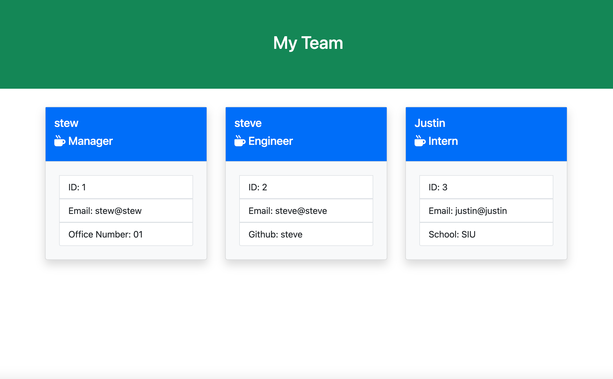
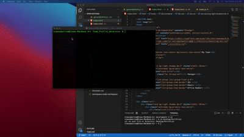

# Team Profile Generator

## Licensing:
   
  <h3>Apache 2.0</h3>
  TERMS AND CONDITIONS FOR USE, REPRODUCTION, AND DISTRIBUTION

      1. Definitions.
      
      "License" shall mean the terms and conditions for use, reproduction, and distribution as defined by Sections 1 through 9 of this document.
      
      "Licensor" shall mean the copyright owner or entity authorized by the copyright owner that is granting the License.

## Table of Contents
  - [Description](#description)
  - [Installation](#installation)
  - [Usage](#usage)
  - [Contribution](#contribution)
  - [Testing](#testing)
  - [Additional Info](#additional-info)

## Description:

  

  

  When I have a new team for a project, I would like to keep track of who is the manager and other teammates. Their information is usually all over the place and it takes time to find it. 
  I built this application to help keep every team members information in one spot.
  I can now go to one spot and find every team members information. From their email, employee ID, github, office number and school if they are still going to college.
  I learned how to use node js, unit tests, generate html with node, constructor functions, how to use arguments and pass them to different functions.

  - Employee constructor function
  `
  class Employee {
  constructor (name, id, email){
      this.name = name;
      this.id = id;
      this.email = email;
  }
  getName () {
      return this.name
  }
  getId () {
      return this.id
  }
  getEmail () {
      return this.email
  }
  getRole () {
      return 'Employee'
  }
  }
  module.exports = Employee
  `

  - Generate HTML function
  `
  const renderHTML = (employees) => {
    pageArray = [];
    for (let i = 0; i < employees.length; i++) {
      const employee = employees[i]
      const role = employee.getRole();
      if (role === "Manager") {  
          const managerCard = manager(employee)
          pageArray.push(managerCard)
          
      } else if (role === "Engineer") {
          const engineerCard = engineer(employee)
          pageArray.push(engineerCard)
          
      } else {
          const internCard = intern(employee)
          pageArray.push(internCard)
      }
  }
  const employeeCards = pageArray.join('')
  const generateTeam = generateTeamPage(employeeCards)
  return generateTeam
  }
  `

## Installation:
  You will need to download the files from github and then cd into the folder where the files are downloaded with terminal and then run npm i to download the dependencies.

## Usage:
  When you have a new team, you can run this app on your terminal and answer the questions regarding your team. Once completed, a html file will be made in the folder where you can see the information regarding your team. **Be careful! If ran again, it will overwrite your html file.

## Contribution:
  If any issues have been found or and features wanted to be added, you can create a pull request on github.
  
## Testing:
  testing is done through the unit tests folder. It tests each employee constructor function.

## Additional Info
  - Github: [stewsabatino](https://github.com/stewsabatino)
  - Email: stewsabatino@gmail.com
  
  